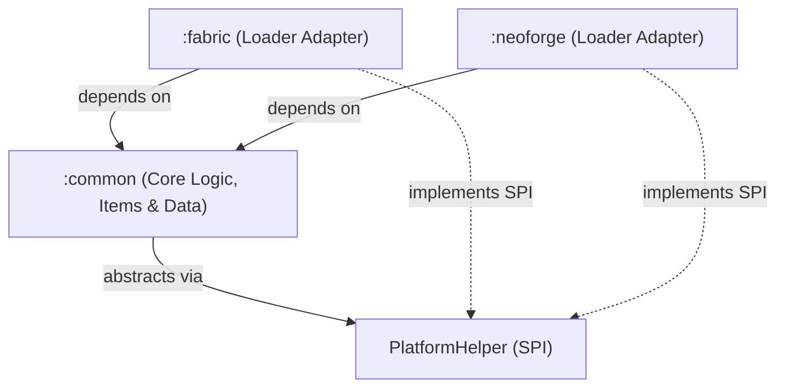
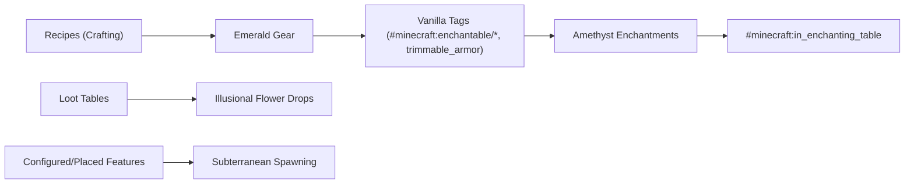

# System Architecture — Emerald Essentials

This document details the architectural design, topological organization, and operational mechanisms of **Emerald Essentials**.

---

## 1. Topological Structure

The project follows a **Non-Monolithic** (multi-module) topology using Gradle:

```
emerald-essentials/
│
├── common/                  ← Core domain logic, items, blocks, enchantments, assets, and data (100% Loader-Agnostic)
│   ├── src/main/java/
│   │   └── com/sxnnyside/emeraldessentials/
│   │       ├── EmeraldEssentials.java
│   │       ├── block/IllusionalFlowerBlock.java
│   │       ├── enchantment/ModEnchantmentHandler.java
│   │       ├── init/ModBlocks.java, ModItems.java, ModCreativeTabs.java
│   │       ├── item/EmeraldDaggerItem.java, ModArmorMaterials.java, ModToolTiers.java
│   │       └── platform/PlatformHelper.java & Services.java
│   ├── src/main/resources/
│   │   ├── assets/emerald_essentials/ (textures, models, blockstates, icon.png, lang/)
│   │   └── data/ (recipes, enchantments, loot_tables, tags/)
│   └── src/test/java/       ← Loader-agnostic automated test suite
│
├── fabric/                  ← Fabric Loader adapter & Fabric API integration
│   ├── src/main/java/
│   │   └── com/sxnnyside/emeraldessentials/fabric/
│   │       ├── EmeraldEssentialsFabric.java
│   │       ├── EmeraldEssentialsFabricClient.java
│   │       └── FabricPlatformHelper.java
│   └── src/main/resources/
│       ├── fabric.mod.json
│       └── META-INF/services/...PlatformHelper
│
└── neoforge/                ← NeoForge Loader adapter & Event Bus integration
    ├── src/main/java/
    │   └── com/sxnnyside/emeraldessentials/neoforge/
    │       ├── EmeraldEssentialsNeoForge.java
    │       ├── EmeraldEssentialsNeoForgeClient.java
    │       └── NeoForgePlatformHelper.java
    └── src/main/resources/
        ├── META-INF/neoforge.mods.toml
        └── META-INF/services/...PlatformHelper
```

---

## 2. Dependency Graph & Isolation Rule



### Strict Isolation Rule
- The `:common` module **must never** import classes from `net.fabricmc.*` or `net.neoforged.*`.
- All Minecraft interactions in `:common` rely strictly on official Mojang mappings (`loom.officialMojangMappings()`), ensuring zero mapping friction when compiling Fabric and NeoForge JARs.
- Client-only code must be isolated in dedicated client classes (`EmeraldEssentialsFabricClient`, `EmeraldEssentialsNeoForgeClient`) to guarantee that dedicated headless servers never crash during startup.

---

## 3. Platform Abstraction Layer (SPI) & Configuration

Cross-loader environment, config paths, and platform services are abstracted behind the `PlatformHelper` interface:

```java
public interface PlatformHelper {
    String getPlatformName();
    boolean isModLoaded(String modId);
    Path getConfigDirectory();
    boolean isDevelopmentEnvironment();
}
```

Implementations are discovered at runtime using Java's standard `ServiceLoader` via `Services.PLATFORM`:
- **Fabric:** Uses `FabricLoader.getInstance()`.
- **NeoForge:** Uses `ModList.get()` and `FMLLoader.isProduction()`.
- **Unit Testing:** Uses `TestPlatformHelper` registered in test resources.

### Lightweight Mod Configuration (`ModConfig`)
- Configuration is stored as a formatted JSON document at `.minecraft/config/emerald_essentials.json`.
- Exposes user-tunable toggles for `enableArmorAbilities`, `enableFlowerParticles`, and `enableBackstabBonus`.
- Fabric provides native in-game settings screen support via **ModMenu** (`ModMenuIntegration`).

---

## 4. Data-Driven Mechanics, Progression & Worldgen

In Minecraft 1.21.1, progression, decoration, and item properties are deeply integrated with the data-pack driven system:



### 1.21 Data Specifications
- **Enchantments**: Stored under `data/emerald_essentials/enchantment/`. Supported items are validated through vanilla tags (`#minecraft:enchantable/head_armor`, `#minecraft:enchantable/chest_armor`, `#minecraft:enchantable/leg_armor`, `#minecraft:enchantable/foot_armor`).
- **Enchanting Table Integration**: Custom enchantments are explicitly registered in `data/minecraft/tags/enchantment/in_enchanting_table.json` for natural survival discovery.
- **Armor Trims**: All emerald armor components are tagged in `data/minecraft/tags/item/trimmable_armor.json` to allow full customization at the vanilla Smithing Table.
- **Loot Tables**: Every custom block defines a loot table in `data/emerald_essentials/loot_table/blocks/` with explosion survival conditions to prevent item voiding upon harvesting.
- **Subterranean World Generation**: Illusional flowers generate naturally in dark subterranean caverns, deepslate strata, and lush cave biomes:
  - Configured feature (`worldgen/configured_feature/illusional_flower.json`).
  - Placed feature with underground placement modifiers (`worldgen/placed_feature/illusional_flower.json`).
  - NeoForge data-driven biome modifier (`neoforge/biome_modifier/add_illusional_flower.json`).
  - Fabric dynamic biome modification (`BiomeModifications.addFeature`).
- **Creative Mode Tab Injection**: In addition to the dedicated `Emerald Essentials` tab, all equipment and flora are injected into vanilla creative tabs (`Combat`, `Tools & Utilities`, `Natural Blocks`) on both platforms.

---

## 5. Combat, Tool & Flora Mechanics

### Emerald Dagger & Backstab
`EmeraldDaggerItem` extends `SwordItem` with specialized stealth strike capability. The backstab detection calculates the dot product between the normalized view vectors of the attacker and the victim:

$$\vec{v}_{\text{attacker}} \cdot \vec{v}_{\text{target}} > 0.6$$

When the attacker strikes from behind, or while crouching / invisible, target invulnerability ticks (`invulnerableTime`) are cleared for rapid, devastating follow-up blows.

### Server Tick Optimization
In `ModEnchantmentHandler.onPlayerTick`:
- Environmental biomes are verified using native `BiomeTags` and temperature checks rather than string parsing.
- World entity searches (`level.getEntitiesOfClass`) for frozen biome undead slowdown are throttled to execute once per second (`player.tickCount % 20 == 0`), eliminating server tick latency.

---

## 6. Build System & Packaging

- **Version Catalog**: Centrally managed dependencies via `gradle/libs.versions.toml`.
- **Artifact Standard**: Jars are assembled with unambiguous, standardized filenames:
  - Fabric: `emerald-essentials-fabric-<version>.jar`
  - NeoForge: `emerald-essentials-neoforge-<version>.jar`
- **Quality Gates**: Enforced locally through `just check` (Spotless, Checkstyle, strict `-Xlint:all` compilation, and JUnit 5 test suite).

---

*Emerald Essentials is A Devil Doll Entertainment Release. Part of the [Sxnnyside Project](https://sxnnysideproject.com).*
